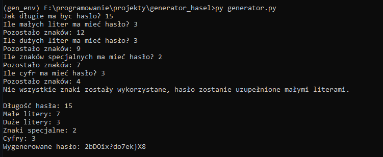

# Generator haseł - Python

Jest to prosta aplikacja generowanie haseł na podstawie danych przekazanych przez użytkownika. 



## Instalacja

1. Kopiujemy repozytorium:
    ```
    git clone https://github.com/matt064/quiz_pyqt5.git
    ```

2. Aplikacja nie wymaga instalacji dodatkowych pakietów.

3. Następnym krokiem jest uruchomienie skryptu:
    Repozytorium posiada dwa moduły:
    a) moduł bardziej złożony, uruchamiany za pomocą komendy:
    ```
    py generator.py
    ```
    b) moduł jednolinijkowy, uruchamiany za pomoca komendy:
    ```
    py generator_one_line.py
    ```


